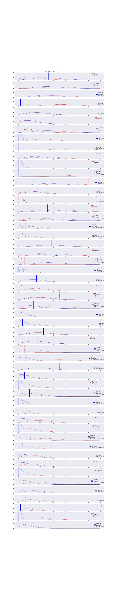

# Life Cycle of a Beer.

## Possible Hypothesis: 

- There is an optimal lifecycle of a specialty brew based on the sales characteristics of past specialty brews
- There are indicators that show that some recipes are more optimal than others
- There is an optimal number of specialty brews to have at a given time based on sales
- There is an ideal mix of specialty brews in terms of variety
- Customers fit a profile based on tastes
- Customers of specific profile like a particular amount of variation

## Initial challenges
- obtaining data
- choosing what data to focus on
- Working with the brewery to get insight into what data would be most useful to them
- Sanitizing data such that personal data was not being compromised
- Addressing other privacy concerns around sensitive data being publicly available

## Motivation
- The part of data science that I am most passionate about is solving real world problems. I know that this brewery has been adversly affected by covid and it is a place that I personally care about. I wanted to help, and the thing that I can bring to the table there in particular that nobody else was equipped to do, is Data Science.
- Ultimately, the reason I chose to work on this is that the study of specialty brews was both interesting to me and it seemed like a great place to make an impact for this business.

## Data Collection
The data was collected directly from a real world point of sale software. It contained sensitive and personally identifiable information, so before I could publish the data I needed to replace names with computer generated names, as well as remove things like credit card info before even being able to consider exploring the data much or putting anything up on github that might be publicly visible.

I also spent some time cleaning the data. Concatenating seperate files of the same type, joining data sets that I knew I wanted relationships for, and removing extraneous data that would get in the way later.

## Purchases 
Purchases were categorized by line item and I wanted to look specifically at something that could have a positive impact on the business, so I chose to focus on what the pos

## Categorization
I split the brews into two categories.
- "Major" sets that were more or less on tap all the time or already have a place in rotation.
- "Minor" sets that were single runs or short runs. 

I split that data where I saw the first patterns of short term recipes showing up. That was at 710 beers sold. In the "Minor" group there was also the need to filter out beverages that were sourced from other companies and would not be expected to fit the same pattern as a specialty brew from this brewery.

## Exploration of approaches
In an attempt to narrow down a way to find indicators that a particular beer was a great success, I tried a lot of approaches.

Each beer was graphed on it's own and the graphs were compared in several ways:
- the eyeball method
- linear regression
- poisson distributions
- A/B splitting with Poisson distribution

## I looked at the timeline

## The lifecycle of a typical brew

## The sales characteristics for each

## Stacked into ordinal days (starting at 0)

## Can we look for improvement?

## Poisson Distributions

## Is it even significant?

## Conclusion
In the end I found a lot of chaos in the data. My ending thoughts are that answering a question such as this is either not possible with the data I have or with the skills I have.

